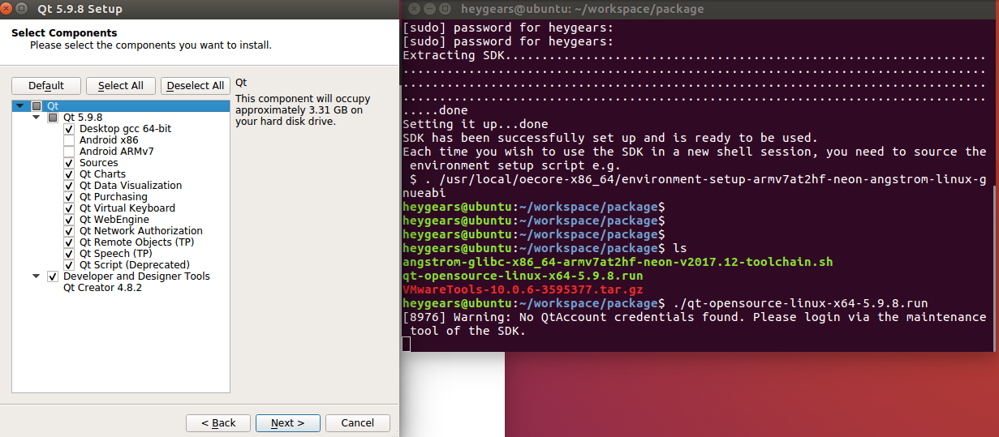
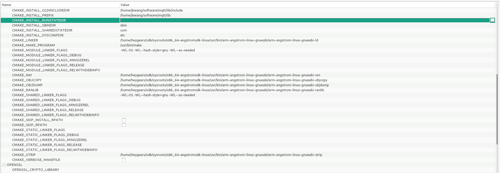

# 1 、Installer 加载

- [ ] 解压  apalis-imx6_toradexeasyinstaller_1.8-20181019.zip
    目录如下：


- [ ]  将JP2跳线帽取下，让板子可以进入串行下载模式
- [ ]  连接好OTG线（双端USB线,可以在设备管理器中查看）
- [ ]  连接好串口终端，按下开机键
- [ ]  终端有输出的情况下，立刻按下 回车 键
- [ ]  输入==bmode usb== 强制进入串行下载模式
- [ ]  双击 apalis-imx6_toradexeasyinstaller_1.8-20181019文件夹下的
      ==recovery-windows.bat==


   如上图所示，installer已经加载进入到内存


# 2、目标系统安装

## 2.1 准备镜像

  下载地址：ftp://ftp.toradex.cn/Linux/I.MX6/Qt5/Apalis_i.MX6/Qt5.9/v28b6/

将下载好的镜像解压装入U盘，插入板上USB接口


## 2.2 目标系统安装

双击选中的系统进行安装，完成后选择重启

*完装完成后，将跳线帽跳回来*


# 3、目标系统设置

## 3.1 登录
进入系统后敲回车
```
apalis-imx6 login: root
```
以 ==root== 用户登录

## 3.2 触摸屏校准

初次进入主界面要进行触摸屏校准
逐次校准四个角的十字架

## 3.3 双屏设置
替换设备树（imx6q-apalis-eval.dtb）

### 3.3.1 挂载U盘

先建一个挂载目录：
```
mkdir /mnt/udisk
```
挂载：
```
root@apalis-imx6:~# mount -t vfat  /dev/sda1 /mnt/udisk/
root@apalis-imx6:~# ls /mnt/udisk/
Apalis-iMX6_Qt5-LXDE-Image-Tezi_2.8b6-20190527  Apalis-iMX6_Qt5-LXDE-Image-Tezi_2.8b6-20190527.tar  apalis-imx6_toradexeasyinstaller_1.8-20181019.zip  imx6q-apalis-eval.dtb  System Volume Information
root@apalis-imx6:~#
```
这里插进去的U盘会在dev目录下，一般是sda~sdz

### 3.3.2 替换imx6q-apalis-eval.dtb
```
$ cp imx6q-apalis-eval.dtb  /media/mmcblk0p1/
$ reboot
```


### 3.3.3 设置环境变量

重启后进入iMX6 uboot下：

```
# setenv vidargs
# saveenv && reset
```

### 3.3.4 测试双屏
```
gst-launch-1.0 -v videotestsrc ! imxv4l2sink device=/dev/video18 force-aspect-ratio=true overlay-width=1920 overlay-height=1080
```

这时会在副屏显示一个图像


# 4、编译环境搭建
	VMware版本： 12.1.1
	Ubuntu 16.04 ：ubuntu-16.04.6-desktop-amd64.iso
	
	User：heygears
	Pw：heygears

## 4.1、重新安装VMware tools


将文件拷贝到/home/heygears/workspace/package/目录
解压：
```
tar -xvf VMwareTools-10.0.6-3595377.tar.gz
```
安装：
```
heygears@ubuntu:~$ sudo ./vmware-install.pl
```

## 4.2、 设置共享文件夹


## 4.3、Ubuntu 16.04 配置

https://developer.toradex.cn/knowledge-base/board-support-package/openembedded-(core)#Prerequisites

```
sudo dpkg --add-architecture i386
sudo apt-get update
sudo apt-get install g++-5-multilib
sudo apt-get install curl dosfstools gawk g++-multilib gcc-multilib lib32z1-dev libcrypto++9v5:i386 libcrypto++-dev:i386 liblzo2-dev:i386 lzop libsdl1.2-dev libstdc++-5-dev:i386 libusb-1.0-0:i386 libusb-1.0-0-dev:i386 uuid-dev:i386 texinfo chrpath
cd /usr/lib; sudo ln -s libcrypto++.so.9.0.0 libcryptopp.so.6
```


## 4.4、SDK 安装
下载地址：ftp://ftp.toradex.cn/Linux/I.MX6/Qt5/SDK/Qt5.9/Apalis_iMX6/v28b6-20190527/

angstrom-glibc-x86_64-armv7at2hf-neon-v2017.12-toolchain.sh

安装：
```
heygears@ubuntu:~/workspace/package$ ./angstrom-glibc-x86_64-armv7at2hf-neon-v2017.12-toolchain.sh 
Angstrom SDK installer version nodistro.0
=========================================
Enter target directory for SDK (default: /usr/local/oecore-x86_64): /home/heygears/sdk/
You are about to install the SDK to "/home/heygears/sdk/". Proceed[Y/n]? Y
[sudo] password for heygears: 
[sudo] password for heygears: 
Extracting SDK.......................................................................................................................................................................................................................................................................................................................done
Setting it up...done
SDK has been successfully set up and is ready to be used.
Each time you wish to use the SDK in a new shell session, you need to source the environment setup script e.g.
 $ . /usr/local/oecore-x86_64/environment-setup-armv7at2hf-neon-angstrom-linux-gnueabi
heygears@ubuntu:~/workspace/package$
```

默认安装在/usr/local/oecore-x86_64目录下，改安装到 ==/home/heygears/sdk/==


## 4.5、  QT5.9.8安装与配置


启动qtcreator时，要使用==root==权限，并导出环境变量


### 4.4.1 查看TdxModule 的ip
```
root@apalis-imx6:~# ifconfig
eth0      Link encap:Ethernet  HWaddr 00:14:2D:4F:A4:D0  
          inet addr:192.168.101.237  Bcast:192.168.101.255  Mask:255.255.255.0
          inet6 addr: fe80::214:2dff:fe4f:a4d0%lo/64 Scope:Link
          UP BROADCAST RUNNING MULTICAST  MTU:1500  Metric:1
          RX packets:69 errors:0 dropped:0 overruns:0 frame:0
          TX packets:70 errors:0 dropped:0 overruns:0 carrier:0
          collisions:0 txqueuelen:1000 
          RX bytes:8293 (8.0 KiB)  TX bytes:10792 (10.5 KiB)

lo        Link encap:Local Loopback  
          inet addr:127.0.0.1  Mask:255.0.0.0
          inet6 addr: ::1%1/128 Scope:Host
          UP LOOPBACK RUNNING  MTU:65536  Metric:1
          RX packets:106242 errors:0 dropped:0 overruns:0 frame:0
          TX packets:106242 errors:0 dropped:0 overruns:0 carrier:0
          collisions:0 txqueuelen:1 
          RX bytes:7645568 (7.2 MiB)  TX bytes:7645568 (7.2 MiB)

usb0      Link encap:Ethernet  HWaddr 00:14:2D:FF:FF:FF  
          UP BROADCAST MULTICAST  MTU:1500  Metric:1
          RX packets:0 errors:0 dropped:0 overruns:0 frame:0
          TX packets:0 errors:0 dropped:0 overruns:0 carrier:0
          collisions:0 txqueuelen:1000 
          RX bytes:0 (0.0 B)  TX bytes:0 (0.0 B)

root@apalis-imx6:~#
```

### 4.4.2 添加设备


192.168.101.237  为韬睿的开发板上的IP，插上网线后会自动获取IP

TdxModule是为板的名字


### 4.4.3 配置qt version


### 4.4.4 配置编译器

C++编译器


C编译器


### 4.4.5 配置Debug


### 4.4.6 开发套件配置


## 4.5、光机库交叉编译
CyUSBSerial_SDK_Linux.zip

光机库 依赖 libusb
### 4.5.1 libusb交叉编译
http://libusb.org/

#### 4.5.1.1 libusb 解压
```
heygears@ubuntu:~/workspace/CyUSBSerial_SDK_Linux/CyUSBSerial_SDK_Linux/libusb$ tar -xvf libusb-1.0.9.tar.bz2
```
#### 4.5.1.2 配置
```
heygears@ubuntu:~/workspace/CyUSBSerial_SDK_Linux/CyUSBSerial_SDK_Linux/libusb/libusb-1.0.9$ ./configure --build=x86_64 --host=arm-linux --prefix=/home/heygears/workspace/libusb/
```
#### 4.5.1.3 编译&安装
```
make 
make install
```
### 4.5.2 CyUSBSerial_SDK_Linux
#### 4.5.2.1 解压
解压到上一级目录
```
unzip CyUSBSerial_SDK_Linux.zip -d ../
heygears@ubuntu:~/workspace/CyUSBSerial_SDK_Linux/CyUSBSerial_SDK_Linux/linux/library$ pwd
/home/heygears/workspace/CyUSBSerial_SDK_Linux/CyUSBSerial_SDK_Linux/linux/library
```
#### 4.5.2.2 修改makefile


#### 4.5.2.3编译
```
Make
```
## 4.6、Quazip交叉编译

Quazip依赖zlib，先编译Zlib

### 4.6.1 zlib交叉编译
源码：http://www.zlib.net/

#### 4.6.1.1解压
```
heygears@ubuntu:~/workspace/package$ tar -xvf zlib-1.2.11.tar.gz -C ../
```
#### 4.6.1.2配置
```
heygears@ubuntu:~/workspace/package$ source /home/heygears/sdk/environment-setup-armv7at2hf-neon-angstrom-linux-gnueabi
heygears@ubuntu:~/workspace/package$./configure  --prefix=/home/heygears/workspace/lib/
```
#### 4.6.1.3编译&安装
```
make 
make install
```
### 4.6.2 Quazip 编译

源码：https://sourceforge.net/projects/quazip/files/quazip/
编译：http://quazip.sourceforge.net/

#### 4.6.2.1 解压
```
heygears@ubuntu:~/workspace/package$ unzip quazip-0.7.3.zip -d ../
```
#### 4.6.2.2 配置
```
heygears@ubuntu:~/workspace/quazip-0.7.3$ source /home/heygears/sdk/environment-setup-armv7at2hf-neon-angstrom-linux-gnueabi
heygears@ubuntu:~/workspace/quazip-0.7.3$ /home/heygears/sdk/sysroots/x86_64-angstromsdk-linux/usr/bin/qt5/qmake PREFIX=/home/heygears/workspace/quaziblib LIBS+=-L/home/heygears/workspace/lib/lib INCLUDEPATH+=/home/heygears/workspace/lib/include
```
#### 4.6.2.3 编译&安装
```
make 
make install
```
## 4.7、Paho mqtt cpp交叉编译

需要用到cmake 3.5版本以上，需有GUI.

源码位置：https://github.com/eclipse/paho.mqtt.cpp           版本号v1.3.0

由于Paho mqtt cpp 依赖于Paho mqtt c库，因此需要编译两个库。

先将两个库均克隆下来。

```
cd /home/jkwang/software/mqtt/
git clone https://github.com/eclipse/paho.mqtt.cpp.git
cd paho.mqtt.cpp
git clone https://github.com/eclipse/paho.mqtt.c.git
```

然后设置交叉编译环境

```
source /home/heygears/sdk/environment-setup-armv7at2hf-neon-angstrom-linux-gnueabi
```

输入  echo $ARCK

判断输出是否为arm,是则设置成功。

### 4.7.1  编译Paho mqtt c库

```
cd paho.mqtt.c/
git checkout v1.3.0
cmake -Bbuild -H. -DPAHO_WITH_SSL=OFF -DPAHO_ENABLE_TESTING=OFF
sudo cmake --build build/ --target install
```

编译成功后，在"/home/jkwang/software/mqtt/paho.mqtt.cpp/paho.mqtt.c/build/src/"下，会生成以下几个文件

```
libpaho-mqtt3c.so.1.3.0
libpaho-mqtt3c.so.1
libpaho-mqtt3c.so
libpaho-mqtt3a.so.1.3.0
libpaho-mqtt3a.so.1
libpaho-mqtt3a.so
```

### 4.7.2  编译Paho mqtt cpp库

```
cmake-gui
```

1、输入源码路径，生成后路径、勾选“Grouped”、“Advanced”.点击“Configure”,弹出对话框后，按照默认选择点击下一步。会出现如下界面。


2、对上图做如下修改，仔细核对已有内容，主要修改了编译器相关设置，以及去掉SSL。





点击生成。然后关闭cmakegui界面，进入build目录下，运行make指令

```
make
```

成功后会在build/src中生成以下三个文件 

```
libpaho-mqttpp3.so.1.0.0
libpaho-mqttpp3.so.1
libpaho-mqttpp3.so
```


# 5、运行

## 5.1 第三方库
```
libcyusbserial.so    libquazip.so    libquazip.so.1.0
libcyusbserial.so.1  libquazip.so.1  libquazip.so.1.0.0
```
将以上的库拷贝到板上

```
cp * /usr/lib/
```
## 5.2 建立目录

可以在home目录下建立好目录，并把file文件拷贝到板上


## 5.3 运行前后台

后台的界面的屏是LVDS的，跑linux framebuffer，要加一个命令行参数
光机的屏是HDMI的不加参数

后台代码更改如下：
projector_widget->showFullScreen();
要移到外面，或者在初始化的时候就show出来。

```
void ProjectionModule::onScrennAdd()
{
    QString name = ProductSettings().ProjectorName("HDMI2");
    qDebug()<<"Config project name:"<<name;

#ifdef Q_OS_WIN32
    projector_widget->setGeometry(QApplication::screens().back()->geometry());
    is_projection_visible = true;
    projector_widget->showFullScreen();
#elif defined(Q_OS_LINUX)
    QList<QScreen*> screen_list = QApplication::screens();
    qDebug()<<screen_list.size();
    for (int i=0;i<screen_list.count();i++) {
        if(screen_list.at(i)->name()== name) //"HDMI1"
        {
            projector_widget->setGeometry(screen_list.at(i)->geometry());
            is_projection_visible = true;
            projector_widget->showFullScreen();
            qDebug()<<"xxxxxxxxxxxxxxxxx";
        }
        qDebug()<<"screen name:"<<screen_list.at(i)->name();
    }
    projector_widget->showFullScreen();
#endif

    qDebug() << Q_FUNC_INFO;
}

```
```
home# ./PrinterEngine  -platform linuxfb:fb="/dev/fb2"&
```
```
home# ./PrinterView &
```

 


# 6、参考
 Qt creator配置

《T02_QtCreator配置.pdf》


# 7 问题&技巧


## 7.1 QT 编译报错

 
解决：
 


## 7.2 scp 拷贝不成功

```
 scp PrinterView  root@192.168.101.237:/home
@@@@@@@@@@@@@@@@@@@@@@@@@@@@@@@@@@@@@@@@@@@@@@@@@@@@@@@@@@@
@    WARNING: REMOTE HOST IDENTIFICATION HAS CHANGED!     @
@@@@@@@@@@@@@@@@@@@@@@@@@@@@@@@@@@@@@@@@@@@@@@@@@@@@@@@@@@@
IT IS POSSIBLE THAT SOMEONE IS DOING SOMETHING NASTY!
Someone could be eavesdropping on you right now (man-in-the-middle attack)!
It is also possible that a host key has just been changed.
The fingerprint for the ECDSA key sent by the remote host is
SHA256:XnoRHleVBC6aqL4rLtRpk0ts0Qfc1vmN4AXa3mQ3Zqc.
Please contact your system administrator.
Add correct host key in /home/heygears/.ssh/known_hosts to get rid of this message.
Offending ECDSA key in /home/heygears/.ssh/known_hosts:1
  remove with:
  ssh-keygen -f "/home/heygears/.ssh/known_hosts" -R 192.168.101.237
ECDSA host key for 192.168.101.237 has changed and you have requested strict checking.
Host key verification failed.
lost connection

```
解决1
vi ~/.ssh/known_hosts

```

  |1|e/0Bw8UK3jVEq4Ob4B1Z4ueGmFw=|xWU6jJUf+2I+B7Tywqbt5Gr/TZE= ecdsa-sha2-nistp256 AAAAE2VjZHNhLXNoYTItbmlzdHAyNTYAAAAIbmlzdHAyNTYAAABBBCB9VI7VCw026nlgUvboOqfcil5R8KhpiXVFonmfsP5qVEjoPeJwfqFATsy5mPzafoGuzZKN+ZeISupnJJa4Z7Q=
```

把 known_hosts的内容删除

或解决2：
```
root@ubuntu:/mnt/hgfs/DS/arm/Src/PrinterView# ssh-keygen  -f "/root/.ssh/known_hosts" -R 192.168.101.237
```

## 7.3 结束进程

```
killall PrinterView 
```

## 7.4 无法从虚拟机运行
 

```
qnx: target.path = /tmp/$${TARGET}/bin
else: unix:!android: target.path = /opt/$${TARGET}/bin
!isEmpty(target.path): INSTALLS += target
```

## 7.5 跨机拷贝

```
scp filename root@192.168.101.237:/home/  
```

## 7.6 查看进程
```
root@apalis-imx6:/home# ps -a
  PID TTY          TIME CMD
  749 ttymxc0  00:00:01 sh
 2378 ttymxc0  00:16:51 PrinterEngine
 2509 ttymxc0  00:00:00 ps
```

 ## 7.8 将QPixmap保存成png

 ```
 QPixmap  mp = screen->grabWindow(0,400,600);
mp.save("testpic", "PNG");
 ```

 ## 7.9 播放mp4
 ```
 gst-launch-1.0 -vvv playbin uri=file:///home/root/testfile.mp4
 ```

 ## 7.10 找不到光机依赖库 usb-1.0
 ```
cc -fPIC -g -Wall -o libcyusb.o -c cyusb.c -I ../../common/header
cc -fPIC -g -Wall -o libcyuart.o -c cyuart.c -I ../../common/header
cc -fPIC -g -Wall -o libcyi2c.o -c cyi2c.c -I ../../common/header
cc -fPIC -g -Wall -o libcyspi.o -c cyspi.c -I ../../common/header
cc -fPIC -g -Wall -o libcyphdc.o -c cyphdc.c -I ../../common/header
cc -fPIC -g -Wall -o libcyjtag.o -c cyjtag.c -I ../../common/header
cc -fPIC -g -Wall -o libcymisc.o -c cymisc.c -I ../../common/header
cc -shared -g -Wl,-soname,libcyusbserial.so -o libcyusbserial.so.1 libcyusb.o libcyuart.o libcyi2c.o libcyspi.o libcyphdc.o libcyjtag.o libcymisc.o -l usb-1.0
/usr/bin/ld: cannot find -lusb-1.0
collect2: error: ld returned 1 exit status
Makefile:2: recipe for target 'all' failed
make: *** [all] Error 1

 ```

 把编译出来的usb库
 拷贝到 /usr/lib/下

## 7.11 光机闪烁

为解决光机闪烁问题，需要把内核的HDMI的刷新频率调整为30HZ

### 7.11.1 系统image
```
ftp://ftp.toradex.cn/Temp/20191022/Apalis-iMX6_Qt5-LXDE-Image-Tezi_2.8b6-20191015.tar
```

### 7.11.2 替换设备树

```
root@apalis-imx6:~# cp /media/sdb1/imx6q-apalis-eval.dtb  /media/mmcblk0p1/
```
### 7.11.3 更换内核与系统模块

```
root@apalis-imx6:~# cat /sys/class/graphics/fb0/mode
S:1920x1080p-60
root@apalis-imx6:~# cp /media/sdb1/new/* ./
root@apalis-imx6:~# ls
Desktop  kernel-modules.tar.bz2  zImage
root@apalis-imx6:~# cp zImage /media/mmcblk0p1/
root@apalis-imx6:~# cd /
root@apalis-imx6:/# tar xvf ~/kernel-modules.tar.bz2 
lib/modules/4.9.166-dirty/
lib/modules/4.9.166-dirty/kernel/
lib/modules/4.9.166-dirty/kernel/crypto/
lib/modules/4.9.166-dirty/kernel/crypto/echainiv.ko
lib/modules/4.9.166-dirty/kernel/drivers/
lib/modules/4.9.166-dirty/kernel/drivers/ata/
lib/modules/4.9.166-dirty/kernel/drivers/ata/ahci.ko
lib/modules/4.9.166-dirty/kernel/drivers/bluetooth/
lib/modules/4.9.166-dirty/kernel/drivers/bluetooth/hci_uart.ko
lib/modules/4.9.166-dirty/kernel/drivers/crypto/
lib/modules/4.9.166-dirty/kernel/drivers/crypto/caam/
lib/modules/4.9.166-dirty/kernel/drivers/crypto/caam/sm_test.ko
lib/modules/4.9.166-dirty/kernel/drivers/hid/
lib/modules/4.9.166-dirty/kernel/drivers/hid/hid-multitouch.ko
lib/modules/4.9.166-dirty/kernel/drivers/i2c/
lib/modules/4.9.166-dirty/kernel/drivers/i2c/algos/
lib/modules/4.9.166-dirty/kernel/drivers/i2c/algos/i2c-algo-pca.ko
lib/modules/4.9.166-dirty/kernel/drivers/i2c/algos/i2c-algo-pcf.ko
lib/modules/4.9.166-dirty/kernel/drivers/input/
lib/modules/4.9.166-dirty/kernel/drivers/input/serio/
lib/modules/4.9.166-dirty/kernel/drivers/input/serio/serport.ko
lib/modules/4.9.166-dirty/kernel/drivers/input/touchscreen/
lib/modules/4.9.166-dirty/kernel/drivers/input/touchscreen/atmel_mxt_ts.ko
lib/modules/4.9.166-dirty/kernel/drivers/input/touchscreen/fusion_F0710A.ko
lib/modules/4.9.166-dirty/kernel/drivers/media/
lib/modules/4.9.166-dirty/kernel/drivers/media/platform/
lib/modules/4.9.166-dirty/kernel/drivers/media/platform/mxc/
lib/modules/4.9.166-dirty/kernel/drivers/media/platform/mxc/capture/
lib/modules/4.9.166-dirty/kernel/drivers/media/platform/mxc/capture/adv7180_tvin.ko
lib/modules/4.9.166-dirty/kernel/drivers/media/platform/mxc/capture/adv7280_tvin.ko
lib/modules/4.9.166-dirty/kernel/drivers/media/platform/mxc/capture/ipu_bg_overlay_sdc.ko
lib/modules/4.9.166-dirty/kernel/drivers/media/platform/mxc/capture/ipu_csi_enc.ko
lib/modules/4.9.166-dirty/kernel/drivers/media/platform/mxc/capture/ipu_fg_overlay_sdc.ko
lib/modules/4.9.166-dirty/kernel/drivers/media/platform/mxc/capture/ipu_prp_enc.ko
lib/modules/4.9.166-dirty/kernel/drivers/media/platform/mxc/capture/ipu_still.ko
lib/modules/4.9.166-dirty/kernel/drivers/media/platform/mxc/capture/max9526_tvin.ko
lib/modules/4.9.166-dirty/kernel/drivers/media/platform/mxc/capture/mx6s_capture.ko
lib/modules/4.9.166-dirty/kernel/drivers/media/platform/mxc/capture/mxc_v4l2_capture.ko
lib/modules/4.9.166-dirty/kernel/drivers/media/platform/mxc/capture/mxc_vadc.ko
lib/modules/4.9.166-dirty/kernel/drivers/media/platform/mxc/capture/ov5640_camera_int.ko
lib/modules/4.9.166-dirty/kernel/drivers/media/platform/mxc/capture/ov5640_camera_mipi_int.ko
lib/modules/4.9.166-dirty/kernel/drivers/media/platform/mxc/capture/ov5642_camera.ko
lib/modules/4.9.166-dirty/kernel/drivers/media/platform/mxc/capture/v4l2-int-device.ko
lib/modules/4.9.166-dirty/kernel/drivers/media/usb/
lib/modules/4.9.166-dirty/kernel/drivers/media/usb/gspca/
lib/modules/4.9.166-dirty/kernel/drivers/media/usb/gspca/gspca_main.ko
lib/modules/4.9.166-dirty/kernel/drivers/media/usb/uvc/
lib/modules/4.9.166-dirty/kernel/drivers/media/usb/uvc/uvcvideo.ko
lib/modules/4.9.166-dirty/kernel/drivers/media/v4l2-core/
lib/modules/4.9.166-dirty/kernel/drivers/media/v4l2-core/videobuf2-dma-contig.ko
lib/modules/4.9.166-dirty/kernel/drivers/media/v4l2-core/videobuf2-memops.ko
lib/modules/4.9.166-dirty/kernel/drivers/media/v4l2-core/videobuf2-vmalloc.ko
lib/modules/4.9.166-dirty/kernel/drivers/net/
lib/modules/4.9.166-dirty/kernel/drivers/net/ppp/
lib/modules/4.9.166-dirty/kernel/drivers/net/ppp/ppp_generic.ko
lib/modules/4.9.166-dirty/kernel/drivers/net/slip/
lib/modules/4.9.166-dirty/kernel/drivers/net/slip/slhc.ko
lib/modules/4.9.166-dirty/kernel/drivers/usb/
lib/modules/4.9.166-dirty/kernel/drivers/usb/class/
lib/modules/4.9.166-dirty/kernel/drivers/usb/class/cdc-acm.ko
lib/modules/4.9.166-dirty/kernel/drivers/usb/class/cdc-wdm.ko
lib/modules/4.9.166-dirty/kernel/drivers/usb/gadget/
lib/modules/4.9.166-dirty/kernel/drivers/usb/gadget/function/
lib/modules/4.9.166-dirty/kernel/drivers/usb/gadget/function/u_ether.ko
lib/modules/4.9.166-dirty/kernel/drivers/usb/gadget/function/u_serial.ko
lib/modules/4.9.166-dirty/kernel/drivers/usb/gadget/function/usb_f_acm.ko
lib/modules/4.9.166-dirty/kernel/drivers/usb/gadget/function/usb_f_ecm.ko
lib/modules/4.9.166-dirty/kernel/drivers/usb/gadget/function/usb_f_ecm_subset.ko
lib/modules/4.9.166-dirty/kernel/drivers/usb/gadget/function/usb_f_eem.ko
lib/modules/4.9.166-dirty/kernel/drivers/usb/gadget/function/usb_f_fs.ko
lib/modules/4.9.166-dirty/kernel/drivers/usb/gadget/function/usb_f_mass_storage.ko
lib/modules/4.9.166-dirty/kernel/drivers/usb/gadget/function/usb_f_ncm.ko
lib/modules/4.9.166-dirty/kernel/drivers/usb/gadget/function/usb_f_obex.ko
lib/modules/4.9.166-dirty/kernel/drivers/usb/gadget/function/usb_f_rndis.ko
lib/modules/4.9.166-dirty/kernel/drivers/usb/gadget/function/usb_f_serial.ko
lib/modules/4.9.166-dirty/kernel/drivers/usb/gadget/function/usb_f_ss_lb.ko
lib/modules/4.9.166-dirty/kernel/drivers/usb/gadget/legacy/
lib/modules/4.9.166-dirty/kernel/drivers/usb/gadget/legacy/g_ether.ko
lib/modules/4.9.166-dirty/kernel/drivers/usb/gadget/legacy/g_mass_storage.ko
lib/modules/4.9.166-dirty/kernel/drivers/usb/gadget/legacy/g_ncm.ko
lib/modules/4.9.166-dirty/kernel/drivers/usb/gadget/legacy/g_serial.ko
lib/modules/4.9.166-dirty/kernel/drivers/usb/gadget/legacy/g_zero.ko
lib/modules/4.9.166-dirty/kernel/drivers/usb/gadget/legacy/gadgetfs.ko
lib/modules/4.9.166-dirty/kernel/drivers/usb/gadget/libcomposite.ko
lib/modules/4.9.166-dirty/kernel/drivers/usb/serial/
lib/modules/4.9.166-dirty/kernel/drivers/usb/serial/option.ko
lib/modules/4.9.166-dirty/kernel/drivers/usb/serial/usb_wwan.ko
lib/modules/4.9.166-dirty/kernel/fs/
lib/modules/4.9.166-dirty/kernel/fs/binfmt_misc.ko
lib/modules/4.9.166-dirty/kernel/fs/configfs/
lib/modules/4.9.166-dirty/kernel/fs/configfs/configfs.ko
lib/modules/4.9.166-dirty/kernel/fs/fat/
lib/modules/4.9.166-dirty/kernel/fs/fat/msdos.ko
lib/modules/4.9.166-dirty/kernel/fs/isofs/
lib/modules/4.9.166-dirty/kernel/fs/isofs/isofs.ko
lib/modules/4.9.166-dirty/kernel/fs/nfs/
lib/modules/4.9.166-dirty/kernel/fs/nfs/flexfilelayout/
lib/modules/4.9.166-dirty/kernel/fs/nfs/flexfilelayout/nfs_layout_flexfiles.ko
lib/modules/4.9.166-dirty/kernel/fs/nls/
lib/modules/4.9.166-dirty/kernel/fs/nls/nls_iso8859-15.ko
lib/modules/4.9.166-dirty/kernel/fs/squashfs/
lib/modules/4.9.166-dirty/kernel/fs/squashfs/squashfs.ko
lib/modules/4.9.166-dirty/kernel/fs/udf/
lib/modules/4.9.166-dirty/kernel/fs/udf/udf.ko
lib/modules/4.9.166-dirty/kernel/lib/
lib/modules/4.9.166-dirty/kernel/lib/crc-itu-t.ko
lib/modules/4.9.166-dirty/kernel/lib/crc7.ko
lib/modules/4.9.166-dirty/kernel/lib/libcrc32c.ko
lib/modules/4.9.166-dirty/kernel/net/
lib/modules/4.9.166-dirty/kernel/net/bluetooth/
lib/modules/4.9.166-dirty/kernel/net/bluetooth/bluetooth.ko
lib/modules/4.9.166-dirty/kernel/net/bluetooth/bnep/
lib/modules/4.9.166-dirty/kernel/net/bluetooth/bnep/bnep.ko
lib/modules/4.9.166-dirty/kernel/net/bluetooth/hidp/
lib/modules/4.9.166-dirty/kernel/net/bluetooth/hidp/hidp.ko
lib/modules/4.9.166-dirty/kernel/net/bluetooth/rfcomm/
lib/modules/4.9.166-dirty/kernel/net/bluetooth/rfcomm/rfcomm.ko
lib/modules/4.9.166-dirty/kernel/net/ipv4/
lib/modules/4.9.166-dirty/kernel/net/ipv4/ip_tunnel.ko
lib/modules/4.9.166-dirty/kernel/net/ipv4/tunnel4.ko
lib/modules/4.9.166-dirty/kernel/net/ipv6/
lib/modules/4.9.166-dirty/kernel/net/ipv6/sit.ko
lib/modules/4.9.166-dirty/kernel/net/mac80211/
lib/modules/4.9.166-dirty/kernel/net/mac80211/mac80211.ko
lib/modules/4.9.166-dirty/kernel/net/wireless/
lib/modules/4.9.166-dirty/kernel/net/wireless/cfg80211.ko
lib/modules/4.9.166-dirty/kernel/sound/
lib/modules/4.9.166-dirty/kernel/sound/core/
lib/modules/4.9.166-dirty/kernel/sound/core/snd-hwdep.ko
lib/modules/4.9.166-dirty/kernel/sound/core/snd-rawmidi.ko
lib/modules/4.9.166-dirty/kernel/sound/usb/
lib/modules/4.9.166-dirty/kernel/sound/usb/snd-usb-audio.ko
lib/modules/4.9.166-dirty/kernel/sound/usb/snd-usbmidi-lib.ko
lib/modules/4.9.166-dirty/source
lib/modules/4.9.166-dirty/build
lib/modules/4.9.166-dirty/modules.order
lib/modules/4.9.166-dirty/modules.builtin
lib/modules/4.9.166-dirty/modules.dep
lib/modules/4.9.166-dirty/modules.dep.bin
lib/modules/4.9.166-dirty/modules.alias
lib/modules/4.9.166-dirty/modules.alias.bin
lib/modules/4.9.166-dirty/modules.softdep
lib/modules/4.9.166-dirty/modules.symbols
lib/modules/4.9.166-dirty/modules.symbols.bin
lib/modules/4.9.166-dirty/modules.builtin.bin
lib/modules/4.9.166-dirty/modules.devname
root@apalis-imx6:/# reboot// 重启
```

### 7.11.4 重置环境变量

进入 uboot后重置启动参数

```
Apalis iMX6 # setenv vidargs 'video=mxcfb0:dev=ldb video=mxcfb1:dev=hdmi,1920x1080M@30,if=RGB24,bpp=24 video=mxcfb2:off video=mxcfb3:off fbmem=32M'
Apalis iMX6 # saveenv 
Saving Environment to MMC...
Writing to MMC(0)... done
Apalis iMX6 # reset
```
### 7.11.5 检查是否成功

```
root@apalis-imx6:~# cat /sys/class/graphics/fb2/mode
U:1920x1080p-30 //30HZ
root@apalis-imx6:~# cat /sys/class/graphics/fb0/mode
U:1920x1080p-59
root@apalis-imx6:~# 
```


# 8 、常用指令

## 8.1 查看内存硬盘大小

查看内存 单位为M
```
root@apalis-imx6:/home/LOG# free -m
              total        used        free      shared  buff/cache   available
Mem:           2019         420        1272          24         325        1551
Swap:             0           0           0
root@apalis-imx6:/home/LOG# 
```

查看硬盘
```
root@apalis-imx6:/home/LOG# df -h
Filesystem      Size  Used Avail Use% Mounted on
/dev/root       3.5G  1.5G  1.9G  44% /
devtmpfs        850M  4.0K  850M   1% /dev
tmpfs          1010M  4.0K 1010M   1% /dev/shm
tmpfs          1010M  536K 1010M   1% /run
tmpfs          1010M     0 1010M   0% /sys/fs/cgroup
tmpfs          1010M   24M  987M   3% /tmp
tmpfs          1010M     0 1010M   0% /var/volatile
/dev/mmcblk0p1   16M  5.4M   11M  34% /media/mmcblk0p1
tmpfs           202M  4.0K  202M   1% /run/user/0
root@apalis-imx6:/home/LOG# 
```


# 9、 sd 卡测试
```
root@apalis-imx6:/home# df -h
Filesystem      Size  Used Avail Use% Mounted on
/dev/root       3.5G  1.5G  1.9G  44% /
devtmpfs        850M  4.0K  850M   1% /dev
tmpfs          1010M  4.0K 1010M   1% /dev/shm
tmpfs          1010M  540K 1010M   1% /run
tmpfs          1010M     0 1010M   0% /sys/fs/cgroup
tmpfs          1010M   24M  987M   3% /tmp
tmpfs          1010M     0 1010M   0% /var/volatile林 
/dev/mmcblk0p1   16M  5.4M   11M  34% /media/mmcblk0p1
tmpfs           202M  4.0K  202M   1% /run/user/0
/dev/mmcblk1     15G   40K   15G   1% /media/mmcblk1 //sd卡挂载目录
```

# 10、 wifi测试(后期使用networkmanager)

https://developer.toradex.cn/knowledge-base/wi-fi-(linux)#wi-fi-connection-bring-up-bsp-v2x

连接管理器（ConnMan）是一个连接管理守护进程（connmand），用于管理运行Linux操作系统的设备中的Internet连接。它提供低内存消耗，并对网络条件变化进行快速，连贯，同步的反应。

```
【2019-08-26 09:02:17:】root@apalis-imx6:~# connmanctl //连接管理工具
【2019-08-26 09:04:01:】connmanctl> enable wifi //使能WIFI
【2019-08-26 09:04:01:】connmanctl> [ 1296.634667] iwlwifi 0000:01:00.0: Radio type=0x1-0x2-0x0
【2019-08-26 09:04:02:】[ 1296.819407] iwlwifi 0000:01:00.0: Radio type=0x1-0x2-0x0
【2019-08-26 09:04:02:】[ 1296.877528] IPv6: ADDRCONF(NETDEV_UP): wlp1s0: link is not ready
【2019-08-26 09:04:02:】Enabled wifi
【2019-08-26 09:04:02:】connmanctl> [ 1297.181972] wlp1s0: authenticate with 40:a5:ef:6a:fa:02
【2019-08-26 09:04:02:】[ 1297.188812] wlp1s0: send auth to 40:a5:ef:6a:fa:02 (try 1/3)
【2019-08-26 09:04:02:】[ 1297.203578] wlp1s0: authenticated
【2019-08-26 09:04:02:】[ 1297.212744] wlp1s0: associate with 40:a5:ef:6a:fa:02 (try 1/3)
【2019-08-26 09:04:02:】[ 1297.220829] wlp1s0: RX AssocResp from 40:a5:ef:6a:fa:02 (capab=0x11 status=0 aid=7)
【2019-08-26 09:04:02:】[ 1297.232513] wlp1s0: associated
【2019-08-26 09:04:02:】[ 1297.244936] IPv6: ADDRCONF(NETDEV_CHANGE): wlp1s0: link becomes ready
【2019-08-26 09:04:05:】[ 1300.349080] wlp1s0: deauthenticated from 40:a5:ef:6a:fa:02 (Reason: 2=PREV_AUTH_NOT_VALID)
【2019-08-26 09:04:05:】[ 1300.544258] IPv6: ADDRCONF(NETDEV_UP): wlp1s0: link is not ready
【2019-08-26 09:04:05:】[ 1300.551741] IPv6: ADDRCONF(NETDEV_UP): wlp1s0: link is not ready
【2019-08-26 09:04:19:】
【2019-08-26 09:04:26:】connmanctl> scan wifi //搜索
【2019-08-26 09:04:26:】Scan completed for wifi
【2019-08-26 09:04:38:】connmanctl> agent on //打开代理
【2019-08-26 09:04:38:】Agent registered
【2019-08-26 09:04:42:】connmanctl> services // 服务列表
【2019-08-26 09:04:42:】*A  heygears             wifi_0022fa552d5e_6865796765617273_managed_psk
【2019-08-26 09:04:42:】    TP-LINK_9633         wifi_0022fa552d5e_54502d4c494e4b5f39363333_managed_psk
【2019-08-26 09:04:42:】    Heygears             wifi_0022fa552d5e_4865796765617273_managed_psk
【2019-08-26 09:04:42:】    R&D                  wifi_0022fa552d5e_522644_managed_psk
【2019-08-26 09:05:08:】connmanctl> connect wifi_0022fa552d5e_6865796765617273_managed_psk //连接wifi
【2019-08-26 09:05:09:】connmanctl> [ 1364.140253] wlp1s0: authenticate with 40:a5:ef:6a:fa:02
【2019-08-26 09:05:09:】[ 1364.148697] wlp1s0: send auth to 40:a5:ef:6a:fa:02 (try 1/3)
【2019-08-26 09:05:09:】[ 1364.158840] wlp1s0: authenticated
【2019-08-26 09:05:09:】[ 1364.172748] wlp1s0: associate with 40:a5:ef:6a:fa:02 (try 1/3)
【2019-08-26 09:05:09:】[ 1364.180426] wlp1s0: RX AssocResp from 40:a5:ef:6a:fa:02 (capab=0x11 status=0 aid=7)
【2019-08-26 09:05:09:】[ 1364.191344] wlp1s0: associated
【2019-08-26 09:05:09:】[ 1364.201701] IPv6: ADDRCONF(NETDEV_CHANGE): wlp1s0: link becomes ready
【2019-08-26 09:05:10:】Connected wifi_0022fa552d5e_6865796765617273_managed_psk
【2019-08-26 09:05:21:】connmanctl> 
【2019-08-26 09:05:53:】connmanctl> connect wifi_0022fa552d5e_522644_managed_psk //连接wifi
【2019-08-26 09:05:53:】connmanctl> [ 1408.273370] wlp1s0: deauthenticating from 40:a5:ef:6a:fa:02 by local choice (Reason: 3=DEAUTH_LEAVING)
【2019-08-26 09:05:53:】[ 1408.303166] IPv6: ADDRCONF(NETDEV_UP): wlp1s0: link is not ready
【2019-08-26 09:05:53:】Agent RequestInput wifi_0022fa552d5e_522644_managed_psk
【2019-08-26 09:05:53:】  Passphrase = [ Type=psk, Requirement=mandatory, Alternates=[ WPS ] ]
【2019-08-26 09:05:53:】  WPS = [ Type=wpspin, Requirement=alternate ]
【2019-08-26 09:05:56:】Passphrase? HEY[ 1411.616263] wlp1s0: authenticate with 40:a5:ef:6a:fa:02
【2019-08-26 09:05:56:】[ 1411.625853] wlp1s0: send auth to 40:a5:ef:6a:fa:02 (try 1/3)
【2019-08-26 09:05:57:】[ 1411.676803] wlp1s0: authenticated
【2019-08-26 09:05:57:】[ 1411.682861] wlp1s0: associate with 40:a5:ef:6a:fa:02 (try 1/3)
【2019-08-26 09:05:57:】[ 1411.690789] wlp1s0: RX AssocResp from 40:a5:ef:6a:fa:02 (capab=0x11 status=0 aid=7)
【2019-08-26 09:05:57:】[ 1411.703624] wlp1s0: associated
【2019-08-26 09:05:57:】[ 1411.716507] IPv6: ADDRCONF(NETDEV_CHANGE): wlp1s0: link becomes ready
【2019-08-26 09:06:00:】
【2019-08-26 09:06:00:】Agent ReportError wifi_0022fa552d5e_522644_managed_psk
【2019-08-26 09:06:00:】  invalid-key
【2019-08-26 09:06:05:】connmanctl> Retry (yes/no)? yes
【2019-08-26 09:06:05:】Agent RequestInput wifi_0022fa552d5e_522644_managed_psk
【2019-08-26 09:06:05:】  Passphrase = [ Type=psk, Requirement=mandatory, Alternates=[ WPS ] ]
【2019-08-26 09:06:05:】  WPS = [ Type=wpspin, Requirement=alternate ]
【2019-08-26 09:06:09:】Passphrase? heygears
【2019-08-26 09:06:09:】Error /net/connman/service/wifi_0022fa552d5e_522644_managed_psk: Input/output error

```
```

#ifconfig


wlp1s0    Link encap:Ethernet  HWaddr 00:22:FA:55:2D:5E  
          inet addr:172.16.2.43  Bcast:172.16.255.255  Mask:255.255.0.0
          inet6 addr: fe80::222:faff:fe55:2d5e%lo/64 Scope:Link
          UP BROADCAST RUNNING MULTICAST  MTU:1500  Metric:1
          RX packets:21201 errors:0 dropped:676 overruns:0 frame:0
          TX packets:1419 errors:0 dropped:0 overruns:0 carrier:0
          collisions:0 txqueuelen:1000 
          RX bytes:3099366 (2.9 MiB)  TX bytes:214073 (209.0 KiB)

```


# 11、 硬盘测试

## 11.1 分区
1、查看现有硬盘分区及挂载状态：

```
root@apalis-imx6:~/app/release# df -h
Filesystem      Size  Used Avail Use% Mounted on
/dev/root       3.5G  1.6G  1.7G  49% /
devtmpfs        850M  4.0K  850M   1% /dev
tmpfs          1010M     0 1010M   0% /dev/shm
tmpfs          1010M  552K 1010M   1% /run
tmpfs          1010M     0 1010M   0% /sys/fs/cgroup
tmpfs          1010M  4.0K 1010M   1% /tmp
tmpfs          1010M     0 1010M   0% /var/volatile
/dev/mmcblk0p1   16M  5.4M   11M  34% /media/mmcblk0p1
tmpfs           202M     0  202M   0% /run/user/0
```
没有找到加载的固态硬盘


2、查看服务器所有已安装的硬盘状态（包括已安装、未安装）

```
root@apalis-imx6:~/app/release# fdisk -l
.....
Disk /dev/mmcblk1: 116.2 GiB, 124721823744 bytes, 243597312 sectors
Units: sectors of 1 * 512 = 512 bytes
Sector size (logical/physical): 512 bytes / 512 bytes
I/O size (minimum/optimal): 512 bytes / 512 bytes
Disklabel type: dos
Disk identifier: 0x00000000

Device         Boot Start       End   Sectors   Size Id Type
/dev/mmcblk1p1      32768 243597311 243564544 116.1G  7 HPFS/NTFS/exFAT


Disk /dev/mmcblk0: 3.6 GiB, 3850371072 bytes, 7520256 sectors
Units: sectors of 1 * 512 = 512 bytes
Sector size (logical/physical): 512 bytes / 512 bytes
I/O size (minimum/optimal): 512 bytes / 512 bytes
Disklabel type: dos
Disk identifier: 0x0403eee1

Device         Boot Start     End Sectors  Size Id Type
/dev/mmcblk0p1       8192   40959   32768   16M  c W95 FAT32 (LBA)
/dev/mmcblk0p2      40960 7520255 7479296  3.6G 83 Linux


Disk /dev/mmcblk0boot1: 16 MiB, 16777216 bytes, 32768 sectors
Units: sectors of 1 * 512 = 512 bytes
Sector size (logical/physical): 512 bytes / 512 bytes
I/O size (minimum/optimal): 512 bytes / 512 bytes


Disk /dev/mmcblk0boot0: 16 MiB, 16777216 bytes, 32768 sectors
Units: sectors of 1 * 512 = 512 bytes
Sector size (logical/physical): 512 bytes / 512 bytes
I/O size (minimum/optimal): 512 bytes / 512 bytes


Disk /dev/sda: 111.8 GiB, 120034123776 bytes, 234441648 sectors
Units: sectors of 1 * 512 = 512 bytes
Sector size (logical/physical): 512 bytes / 4096 bytes
I/O size (minimum/optimal): 4096 bytes / 4096 bytes
Disklabel type: dos
Disk identifier: 0xb6d6dd75
```

找到Disk /dev/mmcblk1: 116.2 GiB       tf卡

​        Disk /dev/sda: 111.8 GiB                 SSD固态硬盘

3、给固态硬盘分区，只分一个区挂载到根目录下

```
root@apalis-imx6:~/app/release#  fdisk /dev/sda

Welcome to fdisk (util-linux 2.30).
Changes will remain in memory only, until you decide to write them.
Be careful before using the write command.


Command (m for help): n
Partition type
   p   primary (0 primary, 0 extended, 4 free)
   e   extended (container for logical partitions)
Select (default p): p
Partition number (1-4, default 1): 1
First sector (2048-234441647, default 2048): 
Last sector, +sectors or +size{K,M,G,T,P} (2048-234441647, default 234441647): 

Created a new partition 1 of type 'Linux' and of size 111.8 GiB.

Command (m for help): w
The partition table has been altered.
Calling ioctl() to re-read partition table.
[  852.393571]  sda: sda1
Syncing disks.
```

4、再次查看磁盘分区状态

```
root@apalis-imx6:~/app/release# fdisk -l
....
Disk /dev/mmcblk1: 116.2 GiB, 124721823744 bytes, 243597312 sectors
Units: sectors of 1 * 512 = 512 bytes
Sector size (logical/physical): 512 bytes / 512 bytes
I/O size (minimum/optimal): 512 bytes / 512 bytes
Disklabel type: dos
Disk identifier: 0x00000000

Device         Boot Start       End   Sectors   Size Id Type
/dev/mmcblk1p1      32768 243597311 243564544 116.1G  7 HPFS/NTFS/exFAT


Disk /dev/mmcblk0: 3.6 GiB, 3850371072 bytes, 7520256 sectors
Units: sectors of 1 * 512 = 512 bytes
Sector size (logical/physical): 512 bytes / 512 bytes
I/O size (minimum/optimal): 512 bytes / 512 bytes
Disklabel type: dos
Disk identifier: 0x0403eee1

Device         Boot Start     End Sectors  Size Id Type
/dev/mmcblk0p1       8192   40959   32768   16M  c W95 FAT32 (LBA)
/dev/mmcblk0p2      40960 7520255 7479296  3.6G 83 Linux


Disk /dev/mmcblk0boot1: 16 MiB, 16777216 bytes, 32768 sectors
Units: sectors of 1 * 512 = 512 bytes
Sector size (logical/physical): 512 bytes / 512 bytes
I/O size (minimum/optimal): 512 bytes / 512 bytes


Disk /dev/mmcblk0boot0: 16 MiB, 16777216 bytes, 32768 sectors
Units: sectors of 1 * 512 = 512 bytes
Sector size (logical/physical): 512 bytes / 512 bytes
I/O size (minimum/optimal): 512 bytes / 512 bytes


Disk /dev/sda: 111.8 GiB, 120034123776 bytes, 234441648 sectors
Units: sectors of 1 * 512 = 512 bytes
Sector size (logical/physical): 512 bytes / 4096 bytes
I/O size (minimum/optimal): 4096 bytes / 4096 bytes
Disklabel type: dos
Disk identifier: 0xb6d6dd75

Device     Boot Start       End   Sectors   Size Id Type
/dev/sda1        2048 234441647 234439600 111.8G 83 Linux
```

已经你能看到新的分区 "/dev/sda1        2048 234441647 234439600 111.8G 83 Linux"

5、格式化分区

```
root@apalis-imx6:~/app/release# mkfs -t ext4  /dev/sda
mke2fs 1.43.5 (04-Aug-2017)
Found a dos partition table in /dev/sda
Proceed anyway? (y,N) y
Discarding device blocks: done                            
Creating filesystem with 29305206 4k blocks and 7331840 inodes
Filesystem UUID: 2050109f-12d3-4f3f-a38d-0deac77100f5
Superblock backups stored on blocks: 
	32768, 98304, 163840, 229376, 294912, 819200, 884736, 1605632, 2654208, 
	4096000, 7962624, 11239424, 20480000, 23887872

Allocating group tables: done                            
Writing inode tables: done                            
Creating journal (131072 blocks): done
Writing superblocks and filesystem accounting information: done
```

6、挂载新磁盘

在 “/home/root目录下”

```
mkdir app
```

执行挂载命令

```
root@apalis-imx6:~/Desktop# mount /dev/sda  /home/root/app
[ 1763.713798] EXT4-fs (sda): mounted filesystem with ordered data mode. Opts: (null)
root@apalis-imx6:~/Desktop# df -h
Filesystem      Size  Used Avail Use% Mounted on
/dev/root       3.5G  1.4G  2.0G  42% /
devtmpfs        850M  4.0K  850M   1% /dev
tmpfs          1010M     0 1010M   0% /dev/shm
tmpfs          1010M  552K 1010M   1% /run
tmpfs          1010M     0 1010M   0% /sys/fs/cgroup
tmpfs          1010M  4.0K 1010M   1% /tmp
tmpfs          1010M     0 1010M   0% /var/volatile
/dev/mmcblk0p1   16M  5.4M   11M  34% /media/mmcblk0p1
tmpfs           202M     0  202M   0% /run/user/0
/dev/sda        110G   60M  104G   1% /home/root/app
```

挂载成功


7、设置开机自动挂载

```
vi /etc/fstab
增加两行，第一行为固态硬盘，第二行为系统设备数、kernal存放
/dev/sda             /home/root/app         auto       defaults              0  0
/dev/mmcblk0p1       /media/mmcblk0p1       auto       defaults              0  0

文件内容如下
/dev/root            /                    auto       noatime               1  1
proc                 /proc                proc       defaults              0  0
devpts               /dev/pts             devpts     mode=0620,gid=5       0  0
usbdevfs             /proc/bus/usb        usbdevfs   noauto                0  0
tmpfs                /run                 tmpfs      mode=0755,nodev,nosuid,strictatime 0  0
tmpfs                /var/volatile        tmpfs      defaults              0  0
/dev/sda             /home/root/app            auto       defaults              0  0
/dev/mmcblk0p1       /boot                auto       defaults              0  0
```


# 12、 屏幕 截图 取反


在QML前端无法取到后端的桌面，后台是基于framebuffer的。

使用QT另外一种方法（QT技术给的）
```
void MainWindow::on_pushButton_clicked()
{
    WId Winid = 69206022;//这里一直为1
    QScreen *screen = QGuiApplication::primaryScreen();
    QPixmap pix =  screen->grabWindow(Winid,0,0,1920,720);
    ui->label->setPixmap(pix);
}
```

原因：
后台加了如下的命令行参数
```
   -platform linuxfb:fb="/dev/fb2"
```


 qt技术又给的方法是：
 ```
 cat /dev/fb2 >frame.raw   再把frame读进来
 ```


还不如把图像在后台截下来，发到前台显示，前后台都要改！！！！

暂时验证可行：
后台：

```
void QProjectorWidget::paintEvent(QPaintEvent *)
{
    if (d->image.isNull())
    {
        return;
    }
    QPainter Painter(this);
    int x = (QWidget::width() - d->image.width()) / 2;
    int y = (QWidget::height() - d->image.height()) / 2;
    QRect target(x,y,d->image.width(),d->image.height());

    if(d->enable)
    {
        Painter.drawImage(target, d->image);
        QString file = d->path+QString("/secPix.png");
        qDebug()<<d->image.save(file,"PNG");
    }
    else
    {
        Painter.eraseRect(0, 0, QWidget::width(), QWidget::height());

        QImage image(width(),height(),QImage::Format_RGB888);
        image.fill(QColor("black"));
        QString file = d->path+QString("/secPix.png");
        qDebug()<<image.save(file,"PNG");
    }
}

```
前台：
```
    qDebug()<<path;

    QPixmap map;
    bool ret = map.load(path+QString("/secPix.png"),"PNG");

    if(ret)
    {
        qDebug()<<"xxxxxxxxxxxxxxxxxxxxxx";
        QImage image = map.toImage();
        uchar * imagebits_32;
        for(int i=0; i<image.height(); ++i)
        {
            imagebits_32 = image.scanLine(i);

            for(int j=0; j<image.width(); ++j)
            {
                imagebits_32[ j * 4 + 2] = ~imagebits_32[ j * 4 + 2];

                imagebits_32[ j * 4 + 1] = ~imagebits_32[ j * 4 + 1];

                imagebits_32[ j * 4] = ~imagebits_32[ j * 4];
            }
        }

        painter->drawImage(QRect(X_,Y_,Width_,Height_),image.scaled(QSize(Width_,Height_),Qt::KeepAspectRatio,Qt::SmoothTransformation));

    }

```

官方例子：
```

          QByteArray ba;
          QBuffer buffer(&ba);
          buffer.open(QIODevice::WriteOnly);
          image.save(&buffer, "PNG"); // writes image into ba in PNG format
```

# 13、 udev 规则文件


## 13.1 下位机

对下位机的串口，通过改配置文件 

```
KERNEL=="ttymxc3",SYMLINK+="uart_main_slave"
```
##  13.2 光度计
```
root@apalis-imx6:~# ls -1 /sys/bus/usb/devices/                                             
1-0:1.0
1-1
1-1:1.0
1-1:1.1
1-1:1.2
2-0:1.0
2-1
2-1:1.0
2-1.2
2-1.2:1.0
2-1.2:1.1
2-1.3
2-1.3:1.0
2-1.3.4 // 外接的hub,这里会变
2-1.3.4:1.0
usb1
usb2
```

```
ACTION=="add",ATTRS{devpath}=="1.3.1" ,ATTRS{idVendor}=="0403",ATTRS{idProduct}=="6001",SYMLINK+="uart_pho"
ACTION=="add",ATTRS{devpath}=="1.3.2" ,ATTRS{idVendor}=="0403",ATTRS{idProduct}=="6001",SYMLINK+="uart_pho"
ACTION=="add",ATTRS{devpath}=="1.3.3" ,ATTRS{idVendor}=="0403",ATTRS{idProduct}=="6001",SYMLINK+="uart_pho"
ACTION=="add",ATTRS{devpath}=="1.3.4" ,ATTRS{idVendor}=="0403",ATTRS{idProduct}=="6001",SYMLINK+="uart_pho"

#ACTION=="add",ATTRS{idVendor}=="0403",ATTRS{idProduct}=="6001",SYMLINK+="uart_pho" //不区分端口也是可的，这样更简单
```

# 14、 secureCRT无法显示中文
连接toradex 板 secureCRT 无法显示中文


# 15、 networkmanager

在Apalis iMX6 Linux 下面

1).  remove connman
```
$ opkg remove connman-gnome connman-client connman
```
2). 此时eth0就disable了，需要重新联网，通过下面命令连接网络
## 启动网口
$ ifconfig eth0 up
## dhcp获取服务
```
$ udhcpc -i eth0
```
3). install dependency package
```
$ opkg update
$ opkg install libmbim_1.14.0-r0_armv7at2hf-neon.ipk

$ opkg install libqmi_1.16.0-r0_armv7at2hf-neon.ipk

$ opkg install modemmanager_1.6.4-r0_armv7at2hf-neon.ipk

$ opkg install networkmanager_1.4.4-r0_armv7at2hf-neon.ipk

```
4). 重启
$ reboot


# 16 设置时间

```
date -s "2019-09-30 15:15:00"
hwclock -w
```


```
root@apalis-imx6:~# timedatectl 
Failed to query server: Failed to read RTC: Invalid argument
root@apalis-imx6:~# timedatectl  set-ntp false
root@apalis-imx6:~# timedatectl  set-time "2019-10-14 08:43:00"
root@apalis-imx6:~# 
root@apalis-imx6:~# date
Mon Oct 14 08:43:46 UTC 2019
root@apalis-imx6:~# 
```

ref:https://developer.toradex.cn/knowledge-base/how-to-use-the-real-time-clock-in-linux


# 17 teamviewer

下载teamviewer host 压缩包 - 
https://download.teamviewer.com/download/linux/teamviewer-host_armhf.tar.xz

## 解压
```
root@apalis-imx6:/media/disk# xz -d teamviewer-host_14.6.2452_armhf.tar.xz 
root@apalis-imx6:/media/disk# ls
3.ultm  db  log  models  teamviewer-host_14.6.2452_armhf.tar
root@apalis-imx6:/media/disk# tar xvf teamviewer-host_14.6.2452_armhf.tar  

```

## 检查依赖库

```
root@apalis-imx6:/media/disk/teamviewer# ./tv-setup checklibs

    -=-   TeamViewer tar.xz check   -=-      

  In order to use the tar.xz version of TeamViewer, 
  you have to make sure that the necessary libraries are installed.

    Writing raw output to /tmp/teamviewerTARLibCheck/DependencyCheck.log

 Analyzing dependencies ...            

        All library dependencies (*.so) seem to be satisfied!

        QtQuickControls seems to be installed

root@apalis-imx6:/media/disk/teamviewer# 
```

## 安装 teamviewer host
$ ./tv-setup install


- TeamViewer如果安装了，可以支持更多功能。
    - 可以支持的命令：
        - teamviewer info 可以得到 TeamviewerID；在标准输出流的最后一行
            - `TeamViewer ID:                        1332034491`
        - teamviewer passwd 123456 可以设置连接密码.
    - 安装的步骤：
        1. sudo ./tv-setup install
        2. 修改配置： /opt/teamviewer/config/global.conf
            - [int32] Always_Online = 1  //开机启动
            - [int32] ChatToThisMachine = 0 //无法发消息到这个机器
            - [int32] HideOnlineStateOfTV = 1 //隐藏窗口信息


 # 附1： 新版本image sdk

2019-08-15版本
 Image和SDK请从下面地址下载：

Image – ftp://ftp.toradex.cn/Linux/I.MX6/Qt5/Apalis_i.MX6/Qt5.9/v28b6/Apalis-iMX6_Qt5-LXDE-Image-Tezi_2.8b6-20190815.tar
SDK – ftp://ftp.toradex.cn/Linux/I.MX6/Qt5/SDK/Qt5.9/Apalis_iMX6/v28b6-20190815/angstrom-glibc-x86_64-armv7at2hf-neon-v2017.12-toolchain.sh

Ycoto编译请参考如下文档
https://developer.toradex.cn/knowledge-base/board-support-package/openembedded-(core)
Linux  kernel/kernel module/device tree 编译请参考下面文档：
https://developer.toradex.cn/knowledge-base/build-u-boot-and-linux-kernel-from-source-code

另外，我之前基于Apalis iMX6 V2.8的toolchain还测试单独编译了QT 5.9.8和5.12.4的源代码，编译流程和使用方法请见附件application note，编译好的相关文件请从下面地址下载：

QT 5.9.8 –ftp://ftp.toradex.cn/Linux/I.MX6/Qt5/Library/amx6/v5.9.8/
QT 5.12.4 - ftp://ftp.toradex.cn/Linux/I.MX6/Qt5/Library/amx6/v5.12.4/

<<278_嵌入式 ARM 平台交叉编译Qt5源代码.pdf>>

# 附2： ARM 平台库

QT-virtualkeyboard
gif
mp4
openssl
ftp
quick 5.9
networkmanager
QDBUS
U盘乱码
开机两次
ntfs挂载
屏幕颜色
HDMI 刷新频率30HZ

